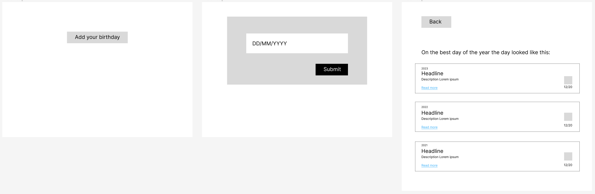
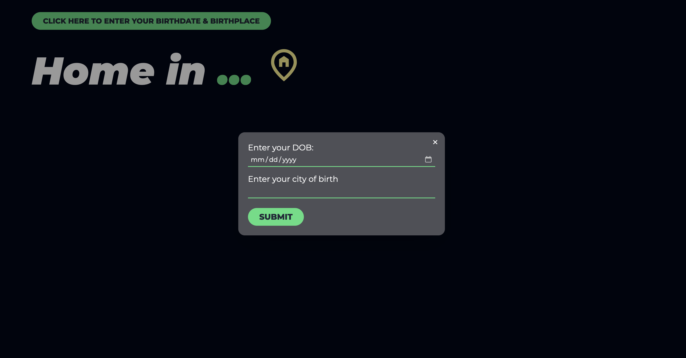
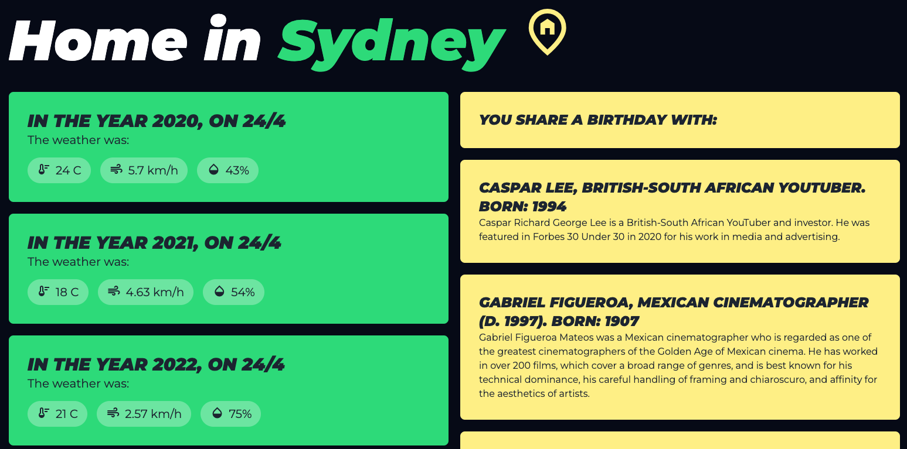

# Best Day of the Year

Coding Bootcamp collaborative group project to solve a real world problem.

## Description

Our project permits a user to input their birthday using a datepicker and using server-side APIs and the application will return:

1. A summary of the weather on their birthday for every year they have lived
2. A summary of significant events that have occurred on their birthday

## Usage

Link to deployed app:
[BEST DAY OF THE YEAR](https://falfada.github.io/best-day-of-the-year/ "link to deployed Best Day of the Year app")

## User story

```md
As a user who likes birthdays
I want to know my birthday's history
So I can prove it is the best day of the year
```

## Acceptance criteria

```md
GIVEN a form with a date and location input
WHEN I input my birthdate and birthplace
THEN I am shown a weather summary for that location for every year of my life
WHEN I view the summary of a particular year
THEN I am shown a summary of any significant events that happened on my birthday 
```

## Images

App wireframe


Final webpage





## Team

1. [Daniela Leal Garcia](https://github.com/falfada "Daniela's Github profile")
2. [Andres Gomez](https://github.com/ANDRESGOM77 "Andres' Github profile")
3. [Jake Bentley](Jake272727 "Jake's github profile")
4. [Jeremy White](https://github.com/roughnut "Jeremy's Github profile")
